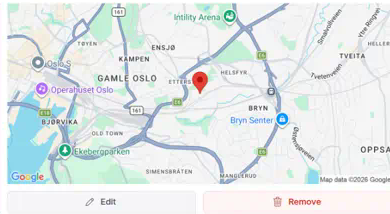
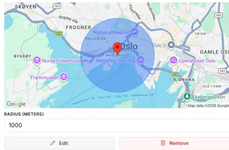

# @sanity/google-maps-input

## What is it?

Plugin for [Sanity Studio](https://www.sanity.io) providing input handlers for geo-related input types using Google Maps.

This plugin will replace the default `geopoint` input component and adds support for `geopointRadius` fields with circle visualization.



## Installation

In your studio folder, run:

```
npm install --save @sanity/google-maps-input
```

## Usage

Add it as a plugin in sanity.config.ts (or .js), with a valid [Google Maps API key](https://developers.google.com/maps/documentation/javascript/get-api-key):

> [!WARNING]
> This plugin will replace the default `geopoint` input component.

```js
import {googleMapsInput} from '@sanity/google-maps-input'

export default defineConfig({
  // ...
  plugins: [
    googleMapsInput({
      apiKey: 'my-api-key',
    }),
  ],
})
```

Ensure that the key has access to:

- Google Maps JavaScript API (for the interactive map)
- Google Static Maps API (for previewing a location)
- Google Places API (New) (for the search feature)

And that the key allows web-access from the Studio URL(s) you are using the plugin in. If the key is missing or rejected, the input renders an inline message explaining what to fix.

### Configuration Options

You can also configure additional options:

```js
import {googleMapsInput} from '@sanity/google-maps-input'

export default defineConfig({
  // ...
  plugins: [
    googleMapsInput({
      apiKey: 'my-api-key',
      defaultZoom: 8,
      defaultRadiusZoom: 15, // zoom level for radius editing
      defaultLocation: {lat: 59.91273, lng: 10.74609},
      defaultRadius: 1000, // for geopointRadius fields
    }),
  ],
})
```

### Field Types

#### Basic Geopoint Field


```typescript
// In your schema
export default {
  name: 'location',
  title: 'Location',
  type: 'geopoint',
}
```

#### Geopoint Radius Field



```typescript
// In your schema
export default {
  name: 'serviceArea',
  title: 'Service Area',
  type: 'geopointRadius',
}
```

The `geopointRadius` field type extends the basic geopoint with:

- A radius property (in meters)
- Visual circle overlay on the map
- Editable radius input field
- Draggable circle for radius adjustment

### Reviewing changes

In the document's **Review changes** pane, `geopoint` and `geopointRadius` values render as a before/after static map preview, matching the look of the built-in image diff.

`geopointRadius` fields get this automatically. Because `geopoint` is a built-in Sanity type, attach the exported `GeopointDiff` component to your `geopoint` fields to opt in:

```typescript
import {GeopointDiff} from '@sanity/google-maps-input'

// In your schema
export default {
  name: 'location',
  title: 'Location',
  type: 'geopoint',
  components: {diff: GeopointDiff},
}
```

## License

MIT-licensed. See LICENSE.
