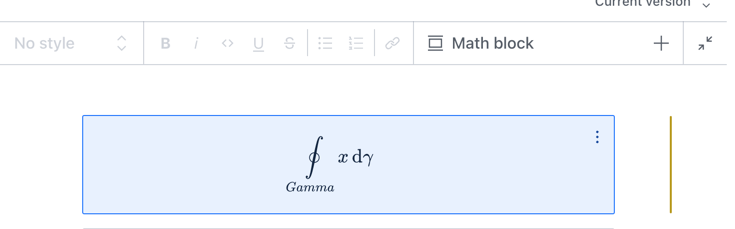

# sanity-plugin-latex-input

> For the v2 version, please refer to the [v2-branch](https://github.com/sanity-io/latex-input/tree/studio-v2).

## What is it?

sanity-plugin-latex-input adds support for `latex` schema type, so it can be used in Portable Text Editor (PTE) in Sanity Studio.



## Installation

```sh
npm install sanity-plugin-latex-input katex
```

## Usage

Import and add the plugin to your studio config in `sanity.config.ts` (or `.js`):

```ts
import {latexInput} from 'sanity-plugin-latex-input'

export default defineConfig({
  /* ... */

  plugins: [latexInput()],
})
```

You may now use the type name `latex` in your schema, such as in portable text.

## Example schema definition for portable text

```ts
const mathInlineIcon = () => (
  <span>
    <span style={{fontWeight: 'bold'}}>∑</span>b
  </span>
)
const mathIcon = () => <span style={{fontWeight: 'bold'}}>∑</span>

export default {
  name: 'portableTextWithLatex',
  type: 'array',
  title: 'Body',
  of: [
    {
      type: 'block',
      title: 'Block',
      of: [{type: 'latex', icon: mathInlineIcon, title: 'Inline math'}],
    },
    {type: 'latex', icon: mathIcon, title: 'Math block'},
  ],
}
```

The Portable Text editor will render a preview of the contents with KaTeX.

## License

MIT-licensed. See LICENSE.
